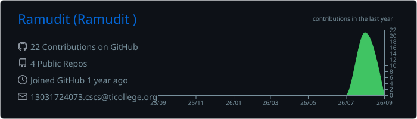
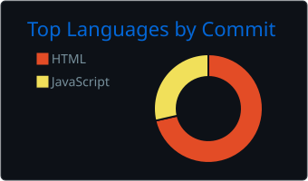
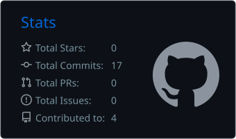
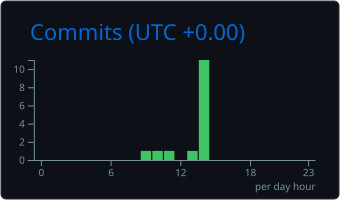

# Hi 👋, I'm Ramudit Singh

### Full-Stack Developer | Cybersecurity Enthusiast | Software Engineering Learner from India 🇮🇳

<p align="center">
  
  
  
</p>

---

## 👨‍💻 About Me

I'm **Ramudit Singh**, a B.Tech student passionate about **Full-Stack Development, Cybersecurity and Software Engineering**.

I enjoy building practical projects, learning new technologies and exploring how software systems work from both development and security perspectives.

* 🔭 Currently working on **Cybersecurity & Full-Stack Development projects**
* 🌱 Currently learning **Java, JDBC, MySQL and Full-Stack Web Development**
* 🛡️ Interested in **Cybersecurity, Network Security and Vulnerability Assessment**
* 💻 Building applications using **Java, Python and Web Technologies**
* 🔎 Practicing security tools such as **Nmap, Wireshark and Metasploit**
* 🐧 Working with **Linux environments**
* 🚀 Interested in both **Software Development and Cybersecurity**
* 📚 Continuously learning and improving my technical skills

---

## 🎯 Current Focus

### 💻 Full-Stack Development

`HTML` `CSS` `JavaScript` `Java` `JDBC` `MySQL` `REST APIs` `CRUD`

### 🛡️ Cybersecurity

`Network Security` `Vulnerability Assessment` `Nmap` `Wireshark` `Metasploit` `CVE` `CVSS`

---

## 🌐 Connect With Me

[](https://www.linkedin.com/in/ramudit-singh-934001326/)

[](https://ramuditsportfolio.netlify.app/)

[](https://github.com/Ramudit)

[](mailto:ramuditsingh4073@gmail.com)

---

# 🛠️ Skills & Technologies

## 🟢 Strong Skills

Technologies and tools that I actively use in projects, practical work and regular learning.

### 💻 Programming Languages

<p>
  
  
  
  
  
</p>

**Java • Python • HTML5 • CSS3 • JavaScript**

### 🌐 Web Development

* HTML5
* CSS3
* JavaScript
* Responsive Web Development
* Frontend Development
* Basic REST API Integration

### 🗄️ Database

<p>
  
</p>

**MySQL • SQL • CRUD • Database Connectivity**

### 🛡️ Cybersecurity


**Security Areas**

* 🔎 Network Scanning
* 🌐 Network Traffic Analysis
* 🛡️ Vulnerability Assessment
* 🔐 Security Testing
* 📡 Network Security
* 📊 CVE / CVSS Concepts
* 🧪 Security Tool Usage

### 🔧 Development Tools

<p>
  
  
  
  
</p>

**Git • GitHub • Linux • VS Code**

---

# 🟡 Familiar With

Technologies and tools that I have worked with or understand at a practical/fundamental level.

### ⚙️ Backend & APIs

<p>
  
  
</p>

**Flask • JDBC • REST APIs • Backend Development • CRUD Applications • API Testing • Spring**

### 🗄️ Database Technologies

<p>
  
</p>

**MongoDB • NoSQL Concepts • Database Design • Database Connectivity**

### 💻 Additional Programming

<p>
  
  
</p>

**C • Bash / Shell Scripting**

### 🧰 Development & API Tools

<p>
  
</p>

**Postman • API Testing • Git Workflows**

### ☁️ Cloud

<p>
  
</p>

**AWS Fundamentals • Cloud Concepts**

---

# 🔵 Exploring

Technologies that I have experimented with or would like to develop further.

### 📱 Mobile Development

<p>
  
  
</p>

**Flutter • Ionic**

### 🎮 Game Development

<p>
  
</p>

**Unity**

### 🎨 Design

<p>
  
</p>

**Adobe Photoshop**

---

# 📚 Technology Overview

| Category         | 🟢 Strong Skills                    | 🟡 Familiar      | 🔵 Exploring      |
| ---------------- | ----------------------------------- | ---------------- | ----------------- |
| Languages        | Java, Python, HTML, CSS, JavaScript | C, Bash          | —                 |
| Web              | HTML, CSS, JavaScript               | REST APIs, Flask | Spring            |
| Backend          | Java, Python                        | Flask, JDBC      | Spring            |
| Database         | MySQL                               | MongoDB          | —                 |
| Security         | Nmap, Wireshark, Metasploit         | CVE, CVSS        | Advanced Security |
| Tools            | Git, GitHub, Linux, VS Code         | Postman          | —                 |
| Cloud            | —                                   | AWS              | Cloud Development |
| Mobile           | —                                   | —                | Flutter, Ionic    |
| Game Development | —                                   | —                | Unity             |
| Design           | —                                   | —                | Photoshop         |

---

# 🚀 Featured Projects

## 🛡️ VulnScan

### Vulnerability Scanning & Assessment Tool

VulnScan is a **group cybersecurity project** designed to scan open ports, identify running services and assist in mapping discovered services to potential vulnerabilities using CVE and CVSS information.

### Technologies

`Python` `Flask` `Nmap` `CVE` `CVSS`

### Key Features

* 🔎 Open port scanning
* 🌐 Service identification
* 🛡️ Vulnerability assessment
* 📊 CVE references
* 📈 CVSS-based vulnerability information
* 📄 Security report generation

[](https://github.com/Ramudit/VULNSCAN)

---

## 🎫 IT Helpdesk

### IT Support Ticket Management System

A database-driven IT Helpdesk project designed to manage support tickets and demonstrate CRUD operations using Java, JDBC and MySQL.

### Technologies

`Java` `JDBC` `MySQL` `HTML` `CSS`

### Key Features

* 🎫 Create support tickets
* 🔍 View tickets
* ✏️ Update tickets
* 🗑️ Delete tickets
* 🗄️ MySQL database integration
* 🔗 JDBC connectivity
* 🔄 CRUD operations

[](https://github.com/Ramudit)

---

## 🌐 Personal Portfolio

### Developer Portfolio Website

A personal portfolio website created to showcase my projects, technical skills and professional profile.

### Technologies

`HTML` `CSS` `JavaScript`

[](https://ramuditsportfolio.netlify.app/)

---

# 📊 GitHub Analytics

## 📈 Profile Summary

<p align="center">
  
</p>

## 🗂️ Repository Languages

<p align="center">
  
  
</p>

## 📊 GitHub Statistics

<p align="center">
  
  
</p>

---

# ⭐ GitHub Stats

<p align="center">
  
  
</p>

---

# 📈 Contribution Activity

<p align="center">
  
</p>

---

# 🔥 GitHub Contribution Streak

<p align="center">
  
</p>

---

# 🐍 Contribution Snake

<p align="center">
  
</p>

---

# 🏆 GitHub Trophies

<p align="center">
  
</p>

---

# 📅 Contribution Calendar

<p align="center">
  
</p>

---

# 💻 Commit Activity

<p align="center">
  
</p>

---

# 📦 Repository Statistics

<p align="center">
  
  
  
  
</p>

---

# 🎯 Areas of Interest

`Full-Stack Development` • `Java Development` • `Python Development` • `Web Development` • `Backend Development` • `Database Management` • `REST APIs` • `Cybersecurity` • `Network Security` • `Vulnerability Assessment` • `Ethical Hacking` • `Linux` • `Software Engineering`

---

# 📌 Explore My Repositories

[](https://github.com/Ramudit?tab=repositories)

[](https://github.com/Ramudit/VULNSCAN)

---

# 🤝 Let's Connect

I'm always interested in connecting with developers, cybersecurity enthusiasts and technology professionals.

Feel free to connect with me for collaboration, project discussions and learning opportunities.

[](https://www.linkedin.com/in/ramudit-singh-934001326/)

[](mailto:ramuditsingh4073@gmail.com)

[](https://ramuditsportfolio.netlify.app/)

---

## ⭐ Thanks for visiting my GitHub profile!

### Keep Learning • Keep Building • Keep Securing 🔐

<p align="center">
  
</p>
```
